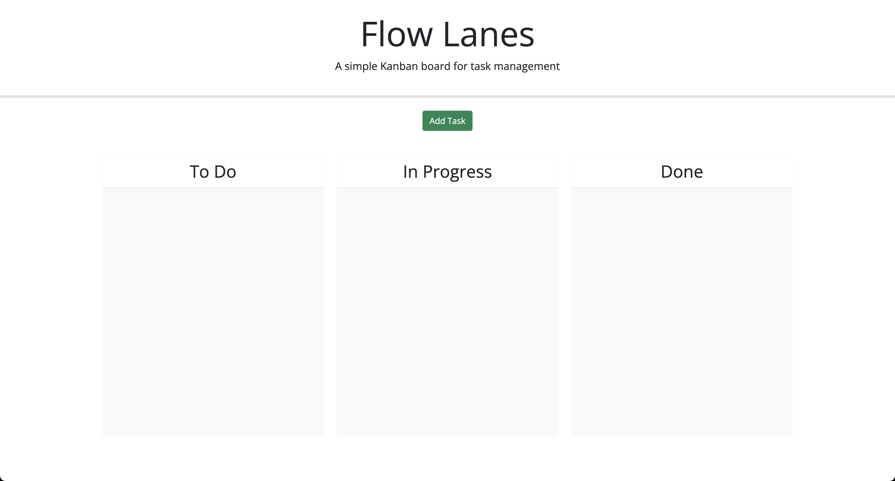
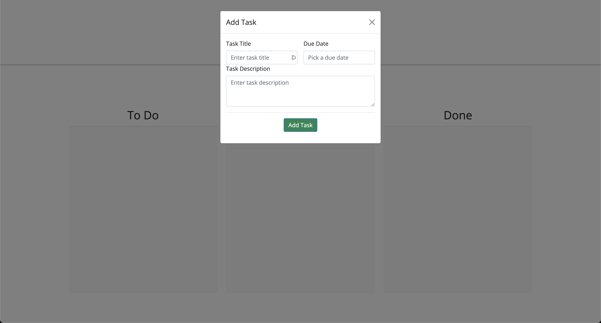
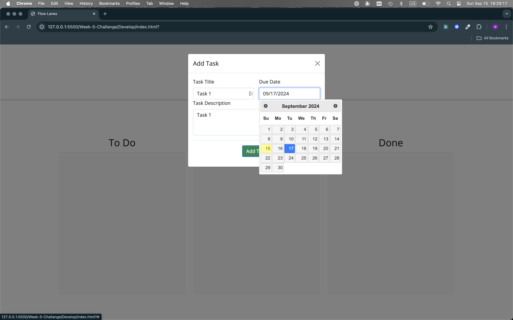
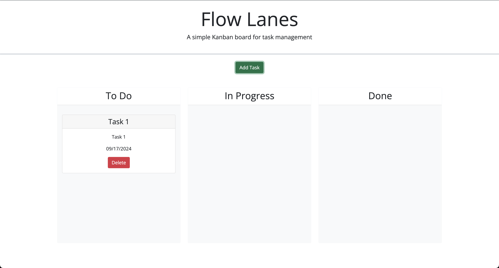
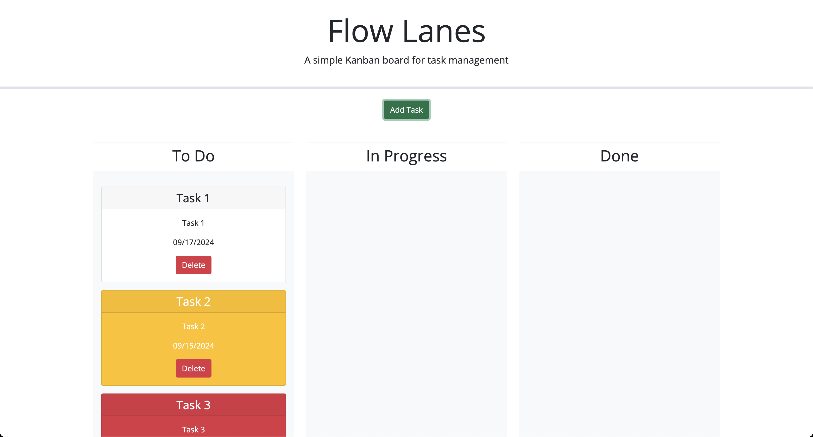
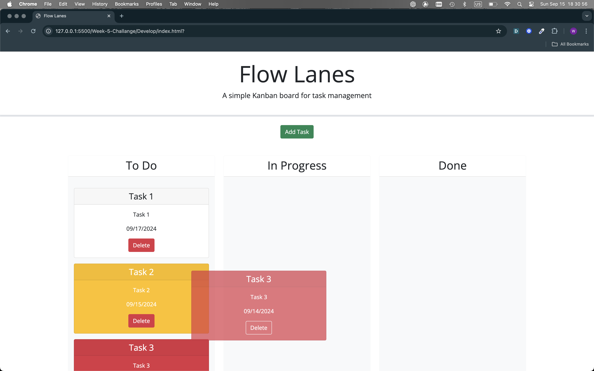
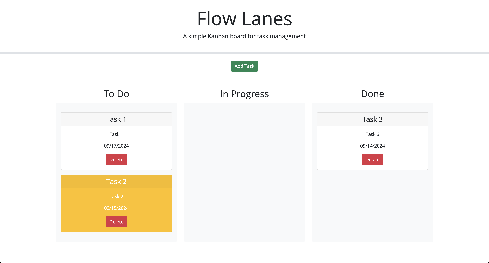
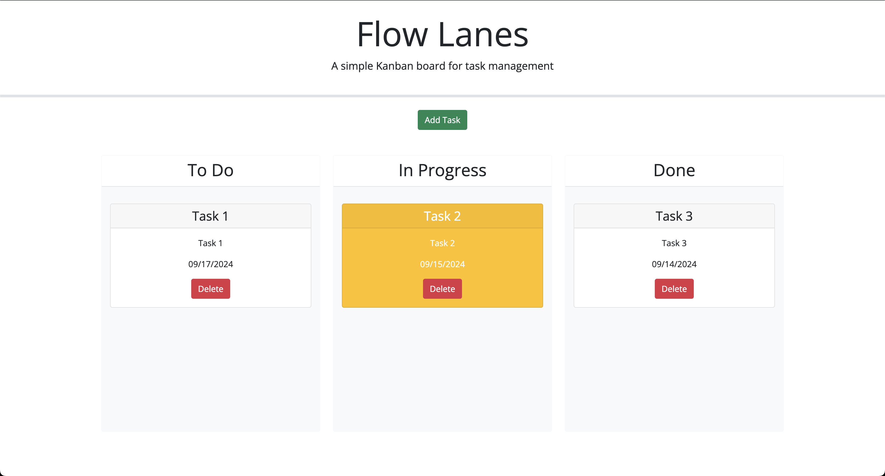

# Week-5-Challange

## Task Board

Title: Flow Lanes

Description:
This website allows visitors to create task cards that have priority color indication using a title, due date, and description; move the cards between the To Do, In Progress, and Done Swimming Lanes on the board once created; and delete tasks from the board. I used html and css to handle the front end elements like the modal, js to handle the functionality, JQuery to call and manipulate different DOM elements, and Day.js to handle date selection and format -->

How to Run:
Please click on deployed link below and you will be prompted to the main page of the application. You can start by clicking the "Add Task" button under the header and filling out the modal information. Once you've filled out each section, simply click the "Add Task" button on the modal and your task will be rendered to the board in the form of a card. You can now pickup and move the card to whichever lane you'd like.

Github Repository : https://github.com/wilsacker/Week-5-Challange Deployed Link : https://wilsacker.github.io/Week-5-Challange/